# Arduino 开发环境下载和驱动的安装


## Arduino IDE下载和驱动的安装

当我们拿到Arduino开发板时，首先我们要安装Arduino IDE和驱动，相关文件我们可以在官网上找到，以下链接是包含各种系统、各种版本的Arduino IDE和驱动任你选择。

<https://www.arduino.cc/en/Main/OldSoftwareReleases#1.5.x>

下面我们介绍下Arduino-1.5.6 版本IDE在Windows系统的安装方法。

下载下来的文件是一个arduino-1.5.6-r2-windows.zip的压缩文件夹，解压出来到硬盘。

双击Arduino-1.5.6 .exe文件

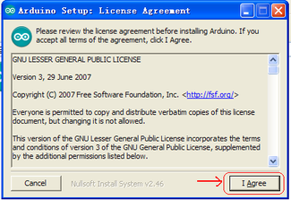

然后

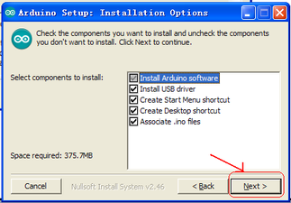

然后

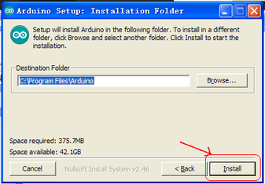

等待安装完成.点击close，安装完成。

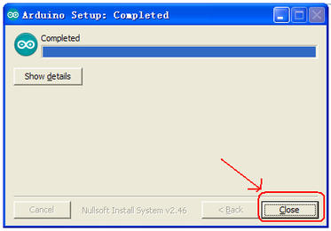

1.5.6版本安装后的样子。

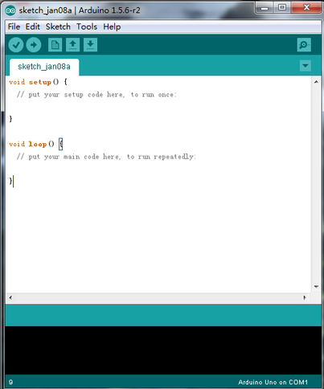

接下来是开发板驱动的安装，这次我们安装的是Keyes UNO R3开发板的驱动，Keyes 2560 R3开发板安装驱动方法和这个类似，驱动文件可以用同一个文件。

不同的系统，安装驱动的方法也有一些细小的区别，下面我们介绍在WIN 7系统安装驱动的方法。

第一次Keyes UNO R3
开发板连接电脑时，点击计算机--属性--设备管理器，显示如下图。

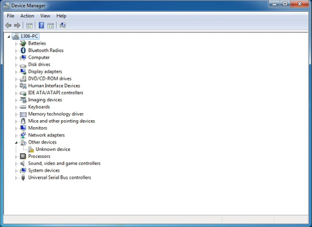

点击 Unknown device 安装驱动，如下图。

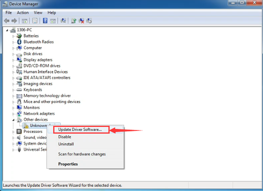

进入下图，选择

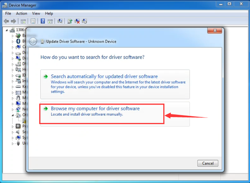

找到Arduino安装位置的drivers文件夹

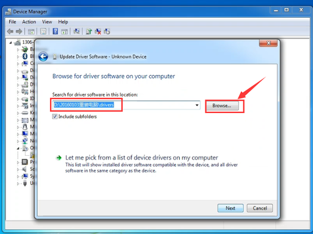

点击“Next”，今天下图选择，开始安装驱动

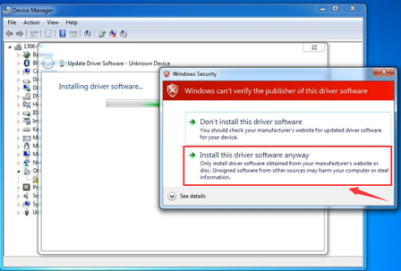

安装驱动完成，出现下图点击Close。

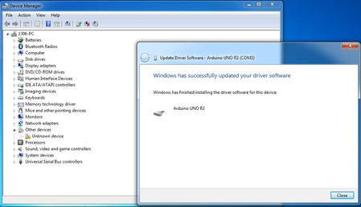

这样驱动就装好了。点击计算机--属性--设备管理器，我们可看见如下图。

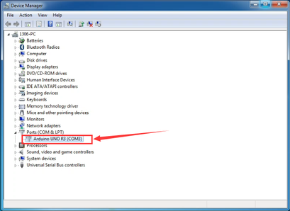

## Arduino IDE的使用方法

Keyes UNO R3
开发板的USB驱动安装成功之后，我们可以在Windows设备管理器中找到相应的串口。

下面示范第一个程序的烧写，串口监视器中显示“Hello World！”。

测试代码为：

```
int val;
int ledpin = 13;    // 定义LED引脚为13

void setup()
{
    Serial.begin(9600);            // 初始化串口通信
    pinMode(ledpin, OUTPUT);      // 设置LED引脚为输出模式
}

void loop()
{
    val = Serial.read();          // 读取串口数据
    if (val == 'R')              // 如果接收到字符'R'
    {
        digitalWrite(ledpin, HIGH);    // LED亮
        delay(500);                     // 延时500ms
        digitalWrite(ledpin, LOW);      // LED灭
        delay(500);                     // 延时500ms
        Serial.println("Hello World!"); // 串口输出"Hello World!"
    }
}
```

我们打开Arduino 的软件，编写一段程序让Keyes UNO R3
开发板接受到我们发的指令就显示“Hello World！”字符串；我们再借用一下Keyes UNO R3 开发板上的 D13
的指示灯，让Keyes UNO R3
开发板接受到指令时指示灯闪烁一下，再显示“Hello World！”。

打开Arduino 的软件，设置板，如下。

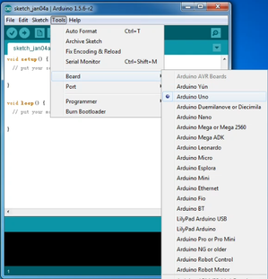

设置COM端口，如下

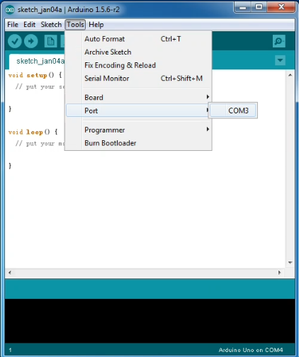

点击编译程序，检查程序是否错误；点击上传程序；Keyes UNO R3 开发板设置OK后右下脚显示如下图，和设备管理器中显示一致。

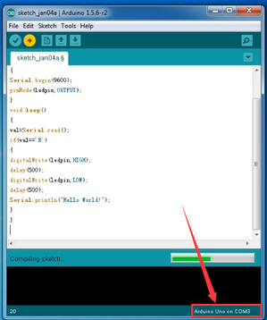

上传成功，输入R，点击发送，Keyes UNO R3 开发板上的 D13
的指示灯闪烁一次，串口监视器中显示 Hello World! 如下图

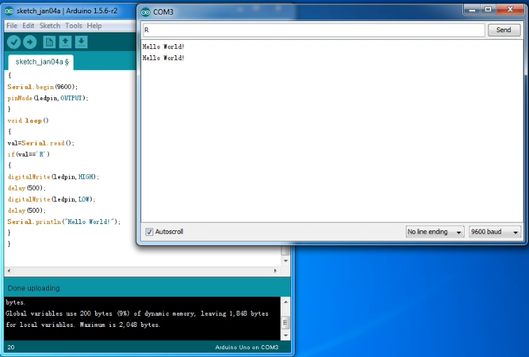

那么恭喜你，你的第一个程序已经成功了！！！


