# 实验课程

## 实验一 LED 闪烁实验

实验说明

LED 闪烁实验是比较基础的实验之一，上一个“ Hello World！”实验里已经利用到了Arduino 自带的LED，这次我们利用其他I/O
口和外接直插LED 灯来完成这个实验。

实验器材

开发板\*1

USB线\*1

LED\*1

220Ω 电阻\*1

面包板\*1

面包板连接线若干

接线图

连接Keyes UNO R3

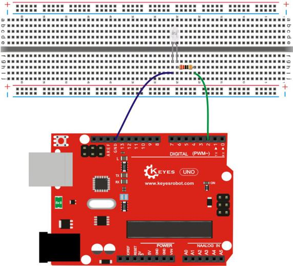

连接Keyes 2560 R3

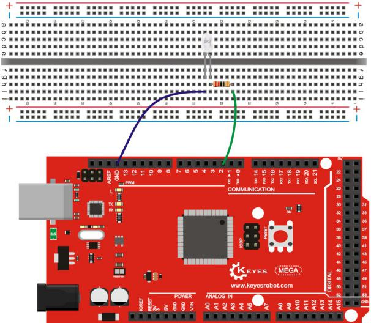

测试代码

```
int led = 2; //定义数字口2

void setup()

{

  pinMode(led, OUTPUT);     //设置led为输出

}

void loop()

{

  digitalWrite(led, HIGH);   //开启led

  delay(2000); //延迟2S

  digitalWrite(led, LOW);    //关闭led

  delay(2000);//延迟2S

}
```
测试结果

下载完程序就可以看到我们的IO口外接小灯在闪烁了，这样我们的实验现象为LED不停闪烁，间隔大约为两秒。

## 实验二 呼吸灯实验

实验说明

上一课程中我们只是控制LED的亮和灭，那么我们可以怎么控制LED的亮度呢？本课程中我们把LED接到PWM口中，然后通过改变PWM数值，调节LED亮度，使LED逐渐变亮，和逐渐变暗，从而达到呼吸灯的效果。

实验器材

开发板\*1

USB线\*1

LED\*1

220Ω 电阻\*1

面包板\*1

面包板连接线若干

接线图

连接Keyes UNO R3

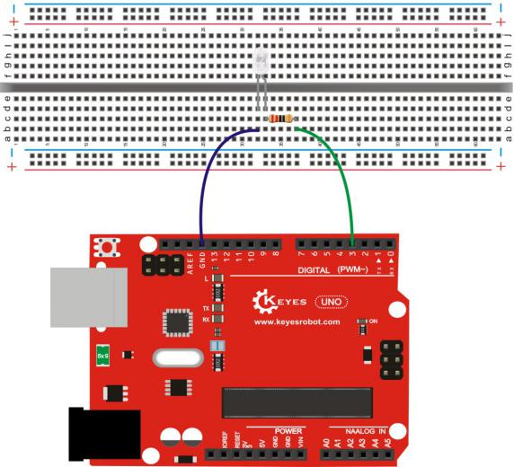

连接Keyes 2560 R3

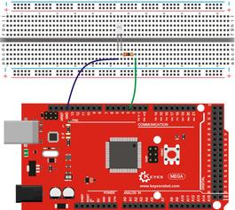

测试代码
```
int ledPin = 3; // 定义数字口3

void setup()

{

pinMode(ledPin, OUTPUT);// 将ledPin设置为输出

}

void loop()

{

for (int a=0; a\<=255;a++)// 设置使LED逐渐变亮

{

analogWrite(ledPin,a); //开启led,调节亮度，范围是0-255，在255时led最亮

delay(10); // 延迟0.01S

}

for (int a=255; a\>=0;a--) // 设置使LED逐渐变暗

{

analogWrite(ledPin,a); //开启led,调节亮度，范围是0-255，在255时led最亮

delay(10); // 延迟0.01S

}

delay(1000);// 延迟1S

}
```
测试结果

下载完程序就可以看到我们的IO口外接小灯显示出呼吸灯的效果，小灯先逐渐变亮，后逐渐变暗，循环交替。

## 实验三 广告灯实验

实验说明

在生活中我们经常会看到一些由各种颜色的led灯组成的广告牌，广告牌上各个位置上癿led灯不断的变话,形成各种效果。本节实验就是利用led灯编程模拟广告灯效果。

实验器材

开发板\*1

USB线\*1

LED\*5

220Ω 电阻\*5

面包板\*1

面包板连接线若干

接线图

连接Keyes UNO R3

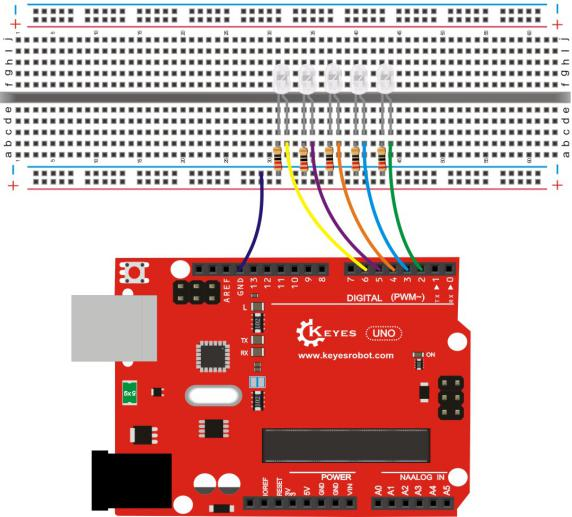

连接Keyes 2560 R3

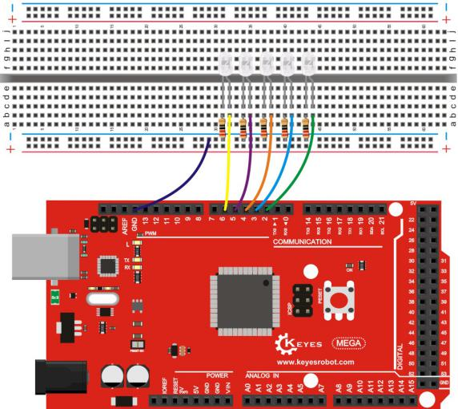

测试代码
```
int BASE = 2 ; //第一个 LED 接的 I/O 口

int NUM = 5; //LED 的总数

void setup()

{

for (int i = BASE; i \< BASE + NUM; i ++)

{

pinMode(i, OUTPUT); //设定数字I/O口为输出

}

}

void loop()

{

for (int i = BASE; i \< BASE + NUM; i ++)

{

digitalWrite(i, HIGH); //设定数字I/O口输出为"高"，即逐渐开灯

delay(200); //延迟

}

for (int i = BASE; i \< BASE + NUM; i ++)

{

digitalWrite(i, LOW); //设定数字I/O口输出为"低"，即逐渐关灯

delay(200); //延迟

}

}
```
测试结果

下载完程序就可以看到我们的IO口外接小灯先逐渐变亮，然后逐渐变暗，循环交替。

## 实验四 按键控制LED实验

实验说明

I/O 口的意思即为INPUT 接口和OUTPUT
接口，到目前为止我们设计的小灯实验都还只是应用到Arduino 的I/O
口的输出功能，这个实验我们来尝试一下使用Arduino的I/O
口的输入功能即为读取外接设备的输出值，我们用一个按键和一个LED
小灯完成一个输入输出结合使用的实验，让大家能简单了解I/O 的作用。

实验器材

开发板 \*1

USB线\*1

LED\*1

轻触按键\*1

220Ω 电阻\*1

10KΩ 电阻\*1

面包板\*1

面包板连接线若干

接线图

连接Keyes UNO R3

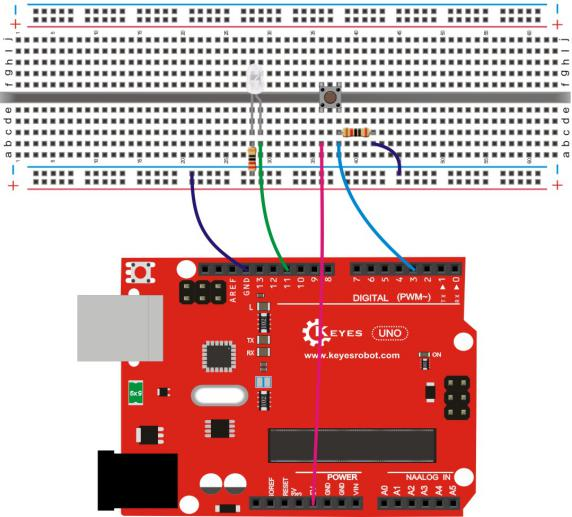

连接Keyes 2560 R3

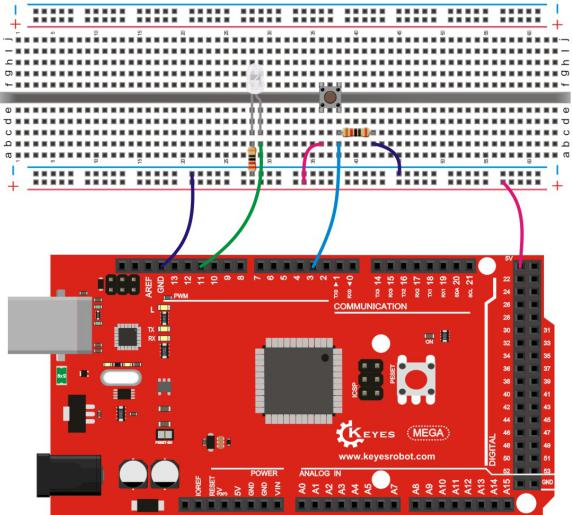

测试代码
```
int ledPin = 11; //定义数字口11

int inputPin = 3; //定义数字口3

void setup()

{

pinMode(ledPin, OUTPUT); //将ledPin设置为输出

pinMode(inputPin, INPUT); //将inputPin设置为输入

}

void loop()

{

int val = digitalRead(inputPin);

//设置数字变量val，读取到数字口3的数值，并赋值给 val

if (val == LOW) //当val为低电平时，LED变暗

{

digitalWrite(ledPin, LOW); // LED变暗

}

else

{

digitalWrite(ledPin, HIGH); // LED亮起

}

}
```
测试结果

下载完程序，上电后，当按键按下时小灯亮起，否则小灯不亮。

## 实验五 抢答器实验

实验说明

完成上面的实验以后相信已经有很多朋友可以独立完成这个实验了，我们可以将上面的按键控制小灯的实验扩展成4个按键对应3
个小灯，占用7个数字I/O 接口。为方便接线，我们把3个小灯用一个keyes
插件RGB模块代替。keyes 插件RGB模块代替由一个插件全彩LED制成，通过 R、
G、
B三个引脚的PWM电压输入可以调节三种基色（红/蓝/绿）的强度从而实现全彩的混色效果。

本实验中我们利用4个按键控制3个PWM口，控制RGB模块发光颜色从而达到抢答器的效果。

实验器材

开发板\*1

USB线\*1

keyes 插件RGB模块\*1

轻触按键\*4

10KΩ 电阻\*4

面包板\*1

面包板连接线若干

杜邦线若干

接线图

连接Keyes UNO R3

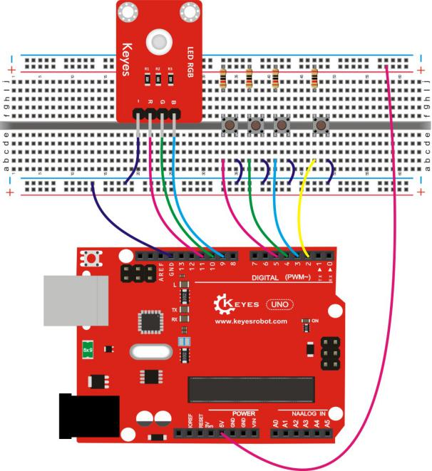

连接Keyes 2560 R3

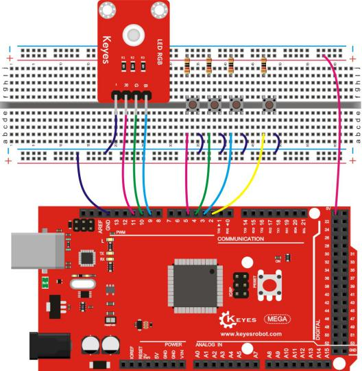

测试代码
```
int redled=11;

int greenled=10;

int blueled=9;

int redpin=5;

int greenpin=4;

int bluepin=3;

int restpin=2;

int red;

int green;

int blue;

void setup()

{

pinMode(redled,OUTPUT);

pinMode(greenled,OUTPUT);

pinMode( blueled,OUTPUT);

pinMode(redpin,INPUT);

pinMode(greenpin,INPUT);

pinMode(bluepin,INPUT);

}

void loop()

{

red=digitalRead(redpin);

green=digitalRead(greenpin);

blue=digitalRead(bluepin);

if(red==LOW)RED_YES();

if(green==LOW)GREEN_YES();

if(blue==LOW)BLUE_YES();

}

void RED_YES()

{

while(digitalRead(restpin)==1)

{

color(255, 0, 0);

}

clear_led();

}

void GREEN_YES()

{

while(digitalRead(restpin)==1)

{

color(0, 255, 0);

}

clear_led();

}

void BLUE_YES()

{

while(digitalRead(restpin)==1)

{

color(0, 0, 255);

}

clear_led();

}

void clear_led()

{

color(0, 0, 0);

}

void color (unsigned char red, unsigned char green, unsigned char blue) //颜色控制函数

{

analogWrite(redled, red);

analogWrite(greenled,green);

analogWrite(blueled, blue);

}
```
测试结果

下载完程序，上电后，一个简单的抢答器就做好了，我们根据RGB灯显示的颜色判断是谁抢答成功。在复位后。RGB灯关闭。

## 实验六 电位器调控灯光亮度实验

实验说明

在第二课程中我们直接通过PWM口控制灯的亮度，从而达到呼吸灯的效果。在这课程中我们通过一个电位器，利用电位器调节PWM值，从而控制灯的亮度。

实验器材

开发板\*1

USB线\*1

LED\*1

220Ω 电阻\*1

可调电位器\*1

面包板\*1

面包板连接线若干

接线图

连接Keyes UNO R3

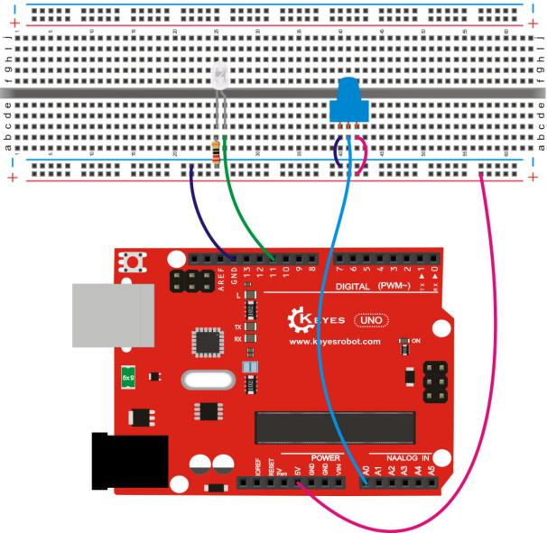

连接Keyes 2560 R3

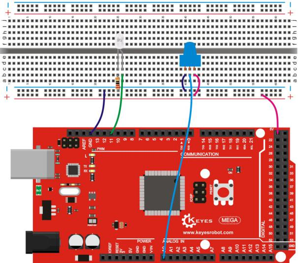

测试代码
```
int ledpin=11;//定义数字接口11（PWM 输出）

void setup()

{

pinMode(ledpin,OUTPUT);//定义数字接口11 为输出

Serial.begin(9600);//设置波特率为9600

}

void loop()

{

int val=analogRead(0);//读取模拟口A0口的值

val = map(val, 0, 1023, 0, 255);//从0-1023映射到0-255

Serial.println(val);//显示val 变量

analogWrite(ledpin,val);// 打开LED 并设置亮度

delay(100);//延时0.1 秒

}
```
测试结果

下载完程序后。我们可以通过旋转可调电位器控制小灯的亮度，打开串口监视器，设置波特率为9600，就可看到调节LED亮度的PWM值。

## 实验七 感光灯实验

实验说明

完成以上的各种实验后，我们对Arduino
的应用也应该有一些认识和了解了，在基本的数字量输入输出和模拟量输入以及PWM
的产生都掌握以后，我们就可以开始进行一些传感器的应用了。

本次实验我们先进行一个较为简单的光敏电阻的使用实验。光敏电阻既然是可以根据光强改变阻值的元件，自然也需要模拟口读取模拟值了，本实验可以借鉴电位器调控灯光亮度实验，将电位计换做光敏电阻实现当光强不同时LED
小灯的亮度也会有相应的变化。

实验器材

开发板\*1

USB线\*1

LED\*1

220Ω 电阻\*1

10KΩ 电阻\*1

光敏电阻\*1

面包板\*1

面包板连接线若干

接线图

连接Keyes UNO R3

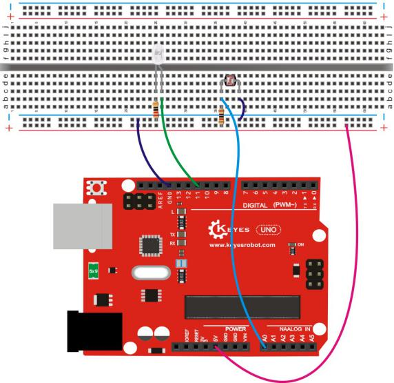

连接Keyes 2560 R3

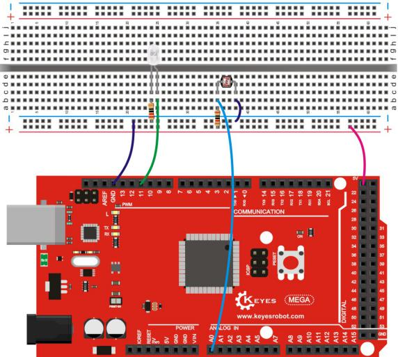

测试代码
```
int ledpin=11;//定义数字接口11（PWM 输出）

void setup()

{

pinMode(ledpin,OUTPUT);//定义数字接口11 为输出

Serial.begin(9600);//设置波特率为9600

}

void loop()

{

int val=analogRead(0);//读取模拟口A0口的值

Serial.println(val);//显示val 变量

val = map(val, 0, 1023, 0, 255);//从0-1023映射到0-255

analogWrite(ledpin,255-val);// 打开LED 并设置亮度

delay(10);//延时0.01 秒

}
```
测试结果

下载完程序后，光敏电阻感应到灯光越亮，小灯越暗；光敏电阻感应到灯光越暗，小灯越亮。打开串口监视器，设置波特率为9600，就可看到光敏电阻感应到外界光强所得的模拟值。

## 实验八 有源蜂鸣器实验

实验说明

蜂鸣器可分为有源蜂鸣器和无源蜂鸣器两种。本课程中主要用到了有源蜂鸣器，有源蜂鸣器内部有一简单的振荡电路，能将恒定的直流电转化成一定频率的脉冲信号。实验中中我们只需要给蜂鸣器输入一个高电平信号，蜂鸣器响起。

实验器材

开发板\*1

USB线\*1

有源蜂鸣器\*1

面包板\*1

面包板连接线若干

接线图

连接Keyes UNO R3

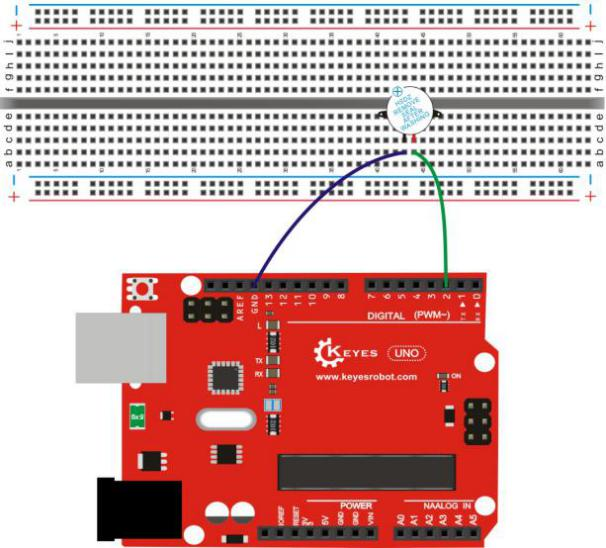

连接Keyes 2560 R3

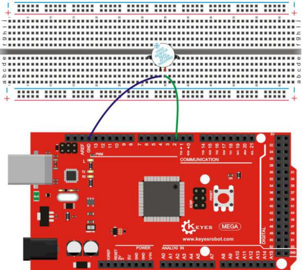

测试代码
```
int led = 2; //定义数字口2

void setup()

{

  pinMode(buzzer, OUTPUT);     //设置led为输出

}

void loop()

{

  digitalWrite(buzzer, HIGH);   //开启buzzer

  delay(1000); //延迟1S

  digitalWrite(buzzer, LOW);    //关闭buzzer

  delay(1000);//延迟1S

}
```
测试结果

下载完程序后，我们可以听到蜂鸣器响1秒，停止响起1秒，循环交替。

## 实验九 无源蜂鸣器实验

实验说明

蜂鸣器可分为有源蜂鸣器和无源蜂鸣器两种。本课程中主要用到了无源蜂鸣器，无源蜂鸣器内部不带振荡源，直流信号无法令其鸣叫，须用方波驱动。

实验器材

开发板 \*1

USB线\*1

无源蜂鸣器\*1

面包板\*1

面包板连接线若干

接线图

连接Keyes UNO R3

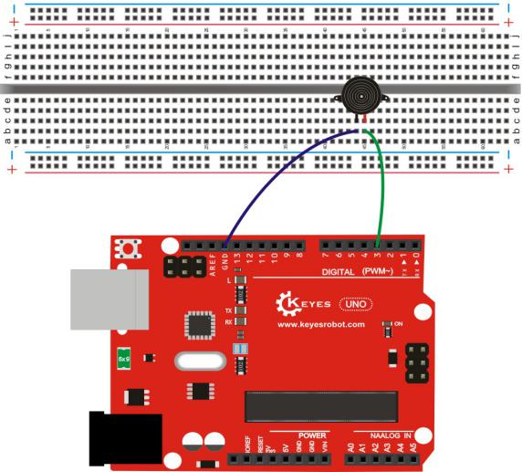

连接Keyes 2560 R3

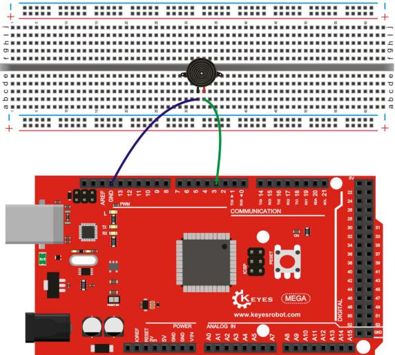

测试代码

code 1:
```
int buzzer=3; //定义数字口3

void setup()

{

pinMode(buzzer,OUTPUT);//将buzzer设置为输出

}

void loop()

{

unsigned char i,j;//定义变量i，j

while(1)

{

for(i=0;i\<80;i++)// 输出一个频率的声音

{

digitalWrite(buzzer,HIGH);

delay(1);//延迟1ms

digitalWrite(buzzer,LOW);

delay(1);//延迟1ms

}

for(i=0;i\<100;i++)// 输出另一个频率的声音

{

digitalWrite(buzzer,HIGH);

delay(2);//延迟2ms

digitalWrite(buzzer,LOW);

delay(2);//延迟2ms

}}}
```
code 2:
```
\#define D0 -1

\#define D1 262

\#define D2 293

\#define D3 329

\#define D4 349

\#define D5 392

\#define D6 440

\#define D7 494

\#define M1 523

\#define M2 586

\#define M3 658

\#define M4 697

\#define M5 783

\#define M6 879

\#define M7 987

\#define H1 1045

\#define H2 1171

\#define H3 1316

\#define H4 1393

\#define H5 1563

\#define H6 1755

\#define H7 1971

//列出全部D调的频率

\#define WHOLE 1

\#define HALF 0.5

\#define QUARTER 0.25

\#define EIGHTH 0.25

\#define SIXTEENTH 0.625

//列出所有节拍

int tune\[\]= //根据简谱列出各频率

{

M3,M3,M4,M5,

M5,M4,M3,M2,

M1,M1,M2,M3,

M3,M2,M2,

M3,M3,M4,M5,

M5,M4,M3,M2,

M1,M1,M2,M3,

M2,M1,M1,

M2,M2,M3,M1,

M2,M3,M4,M3,M1,

M2,M3,M4,M3,M2,

M1,M2,D5,D0,

M3,M3,M4,M5,

M5,M4,M3,M4,M2,

M1,M1,M2,M3,

M2,M1,M1

};

float durt\[\]= //根据简谱列出各节拍

{

1,1,1,1,

1,1,1,1,

1,1,1,1,

1+0.5,0.5,1+1,

1,1,1,1,

1,1,1,1,

1,1,1,1,

1+0.5,0.5,1+1,

1,1,1,1,

1,0.5,0.5,1,1,

1,0.5,0.5,1,1,

1,1,1,1,

1,1,1,1,

1,1,1,0.5,0.5,

1,1,1,1,

1+0.5,0.5,1+1,

};

int length;

int tonepin=3; //得用3号接口

void setup()

{

pinMode(tonepin,OUTPUT);

length=sizeof(tune)/sizeof(tune\[0\]); //计算长度

}

void loop()

{

for(int x=0;x\<length;x++)

{

tone(tonepin,tune\[x\]);

delay(500\*durt\[x\]);
//这里用来根据节拍调节延时，500这个指数可以自己调整，在该音乐中，我发现用500比较合适。

noTone(tonepin);

}

delay(2000);

}
```
测试结果

实验中我们提供了两个例程，上传例程1代码后，蜂鸣器会发出两种不同的声音，实验中，两种声音循环交替。上传例程2中代码后，蜂鸣器会想响起《欢乐颂》的曲子。

## 实验十 火焰报警实验

实验说明

火焰传感器是机器人专门用来搜寻火源的传感器，本传感器对火焰特别灵敏。火焰传感器利用红外线对火焰非常敏感的特点，使用特制的红外线接收管来检测火焰，然后把火焰的亮度转化为高低变化的电平信号。

实验中，我们把火焰的亮度转化为高低变化的电平信号输入到UNO板中，然后控制蜂鸣器的响起。

实验器材

开发板\*1

USB线\*1

有源蜂鸣器\*1

火焰传感器\*1

10KΩ 电阻\*1

面包板\*1

面包板连接线若干

接线图

连接Keyes UNO R3

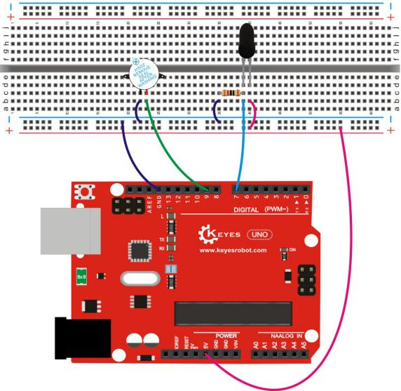

连接Keyes 2560 R3

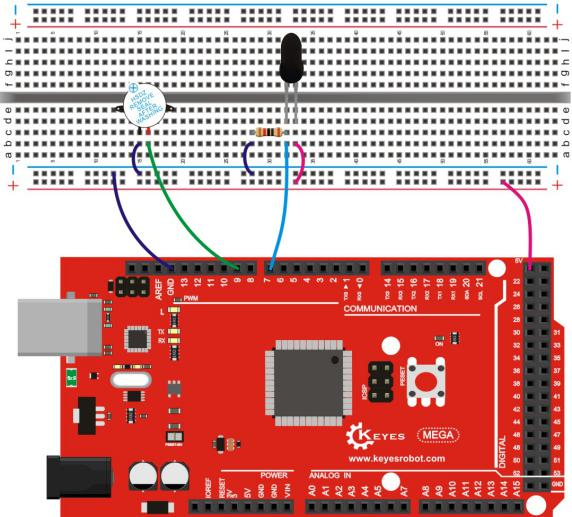

测试代码
```
int flame=7;//定义火焰接口为数字7 接口

int Beep=9;//定义蜂鸣器接口为数字9 接口

void setup()

{

pinMode(Beep,OUTPUT);//定义Beep为输出接口

pinMode(flame,INPUT);//定义flame为输入接口

}

void loop()

{

int val=digitalRead(flame);//读取火焰传感器

if(val==HIGH)//当数字口7为高电平时蜂鸣器鸣响

{

digitalWrite(Beep,HIGH);

}else

{

digitalWrite(Beep,LOW);

}

delay(500);

}
```
测试结果

下载完程序后，我们可以模拟在有火焰时报警的情况，在没有火焰时一切正常，当有火焰时立刻报警做出提示。

## 实验十一 温馨水杯实验

实验说明

LM35 是很常用且易用的温度传感器元件，将LM35
温度传感器接到开发板上，通过算法可将读取的模拟值转换为实际的温度。

本实验中我们还外接了3个指示灯，在代码中我没设置在不同的温度范围，亮起不同颜色的指示灯。根据这个，我们完全可以做个温馨水杯，通过指示灯，我们就可以知道杯子里的水的冷热情况。

实验器材

开发板 \*1

USB线\*1

LM35DZ\*1

LED\*3

220Ω 电阻\*3

面包板\*1

面包板连接线若干

接线图

连接Keyes UNO R3


连接Keyes 2560 R3

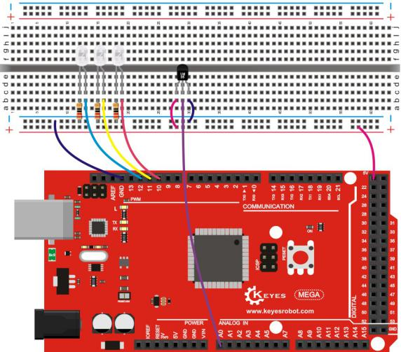

测试代码
```
void setup() {

Serial.begin(9600);

pinMode(12, OUTPUT);

pinMode(11, OUTPUT);

pinMode(10, OUTPUT);

}

void loop() {

int vol = analogRead(A0) \* (5.0 / 1023.0\*100);

Serial.print("Tep:");

Serial.print(vol);

Serial.println("C");

if (vol\<28)

{

digitalWrite(12, HIGH);

digitalWrite(11, LOW);

digitalWrite(10, LOW);

}

else if (vol\>=28 && vol\<=30)

{

digitalWrite(12, LOW);

digitalWrite(11, HIGH);

digitalWrite(10, LOW);

}

else if (vol\>30)

{

digitalWrite(12, LOW);

digitalWrite(11, LOW);

digitalWrite(10, HIGH);

}

}
```
测试结果

下载完程序后，打开串口监视器，设置波特率为9600，就可看到当前的温度。当温度大于30摄氏度时，红色指示灯亮起，其他指示灯熄灭；当温度大于等于28摄氏度且小于等于30摄氏度时，红色指示灯熄灭，黄色指示灯亮起；当温度小于28摄氏度时，黄色指示灯熄灭，蓝色指示灯亮起。

## 实验十二 魔术光杯实验

实验说明

倾斜开关的工作原理是当开关一端低于水平位置倾斜，开关寻通；当另一端低于水平位置倾斜
，开关停止。魔术光杯实验原理是利用 PWM
调光的原理，两个LED的亮度发生变化。

这个实验中倾斜开关提供数字信号，触发 PWM
的调节，通过程序的设计，我们就能看到类似于两组装满光的杯子倒来倒去的效果了。

实验器材

开发板\*1

USB线\*1

LED\*2

倾斜开关\*2

220Ω 电阻\*2

10KΩ 电阻\*2

面包板\*1

面包板连接线若干

接线图

连接Keyes UNO R3

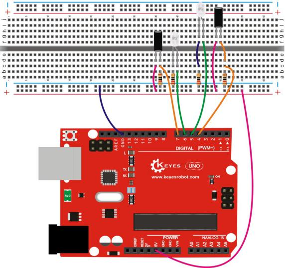

连接Keyes 2560 R3

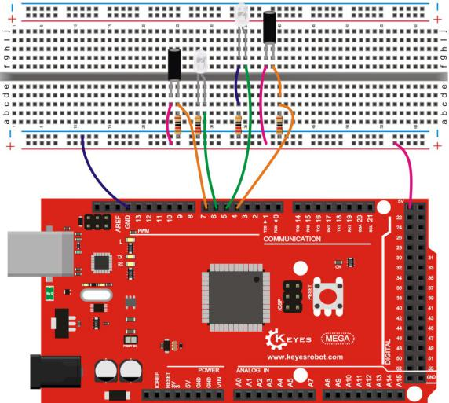

测试代码
```
int LedPinA = 5; //定义数字口5

int LedPinB = 6; //定义数字口6

int ButtonPinA = 7;//定义数字口7

int ButtonPinB = 4;//定义数字口4

int buttonStateA = 0;

int buttonStateB = 0;

int brightnessA = 0;

int brightnessB= 255;

void setup()

{

Serial.begin(9600);//设置波特率

pinMode(LedPinA, OUTPUT);//数字口5设置为输出

pinMode(LedPinB, OUTPUT);//数字口6设置为输出

pinMode(ButtonPinA, INPUT);//数字口7设置为输入

pinMode(ButtonPinB, INPUT);//数字口4设置为输入

}

void loop()

{

buttonStateA =
digitalRead(ButtonPinA);//读取数字口7的数值赋值给buttonStateA

if (buttonStateA == HIGH && brightnessA != 255)

//当buttonStateA为高电平且brightnessA不为255

{

brightnessA ++;//brightnessA加1

delay(10);//延迟0.01S

}

if (buttonStateA == LOW && brightnessA != 0)

//当buttonStateA为低电平且brightnessA不为0

{

brightnessA --;//brightnessA减1

delay(10);//延迟0.01S

}

analogWrite(LedPinB, brightnessA);//将brightnessA赋值为给PWM口6

Serial.print(brightnessA);//显示brightnessA数值

Serial.print(" ");

buttonStateB =
digitalRead(ButtonPinB);//读取数字口4的数值赋值给buttonStateB

if (buttonStateB == HIGH && brightnessB != 0)

//当buttonStateB为高电平且brightnessA不为0

{

brightnessB --;//brightnessB减1

delay(10);//延迟0.01S

}

if (buttonStateB == LOW && brightnessB != 255)

//当buttonStateB为低电平且brightnessA不为255

{

brightnessB++;//brightnessB加1

delay(10);//延迟0.01S

}

analogWrite(LedPinA, brightnessB); //将brightnessB赋值为给PWM口5

Serial.println(brightnessB);//显示brightnessB数值，并自动换行

delay(5);

}
```
测试结果

按照上图接好线，烧录好代码，上电后，将两个倾斜开关同时倾斜一边，
一个LED逐渐变暗，同时另一个逐渐变亮，最终一个LED完全熄灭，一个LED最亮；在串口监视器中看到对应具体数值变化，如下图。当倾斜另一边中，现象一样，方向相反。

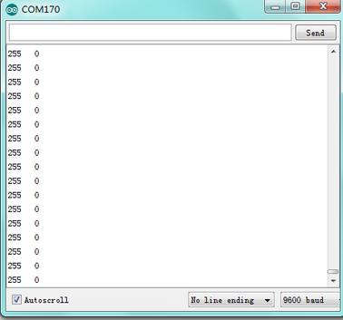

## 实验十三 红外遥控解码实验

实验说明

通用红外遥控系统由发射和接收两大部分组成。本实验中发射部分就是遥控器，接收部分就是红外接收
VS1838B。红外接收
VS1838B是集接收、放大、解调一体的器件，它内部IC就已经完成了解调，输出的就是数字信号。

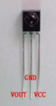

实验器材

开发板\*1

USB线\*1

红外遥控\*1

红外接收 VS1838B\*1

面包板\*1

面包板连接线若干

接线图

连接Keyes UNO R3

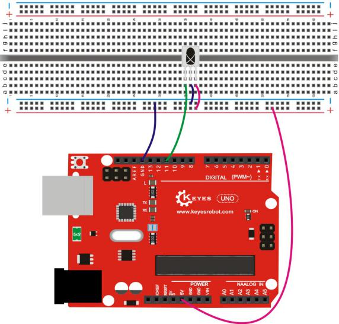

连接Keyes 2560 R3

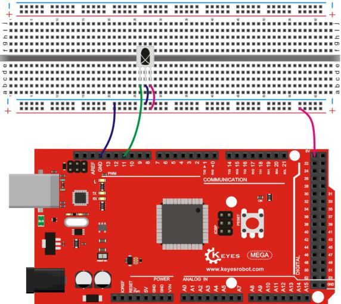

测试代码
```
\#include \<IRremote.h\>

int RECV_PIN = 11; //定义数字口11

IRrecv irrecv(RECV_PIN);

decode_results results;

void setup()

{

Serial.begin(9600);//设置波特率

irrecv.enableIRIn(); // 使能红外接收

}

void loop() {

if (irrecv.decode(&results))

{

Serial.println(results.value, HEX);//显示数据

irrecv.resume(); // 接收下个数据

}

}
```
测试结果

下载完程序，上电后，红外遥控对准红外接收传感器发送信号，我们可以在串口监视器总看到相应按键的编码，如下图。

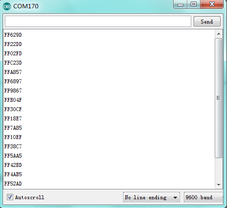

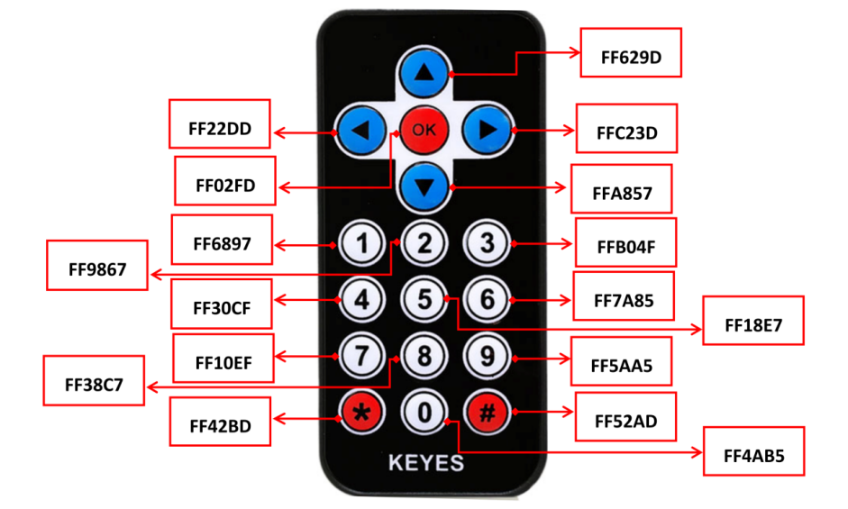

## 实验十四 一位数码管显示实验

实验说明

数码管是一种半导体发光器件，其基本单元是发光二极管。数码管按段数分为七段数码管和八段数码管，八段数码管比七段数码管多一个发光二极管单元（多一个小数点显示），本实验所使用的是八段数码管。数码管共有七段显示数字的段，还有一个显示小数点的段。当让数码管显示数字时，只要将相应的段点亮即可。

实验器材

开发板 \*1

USB线\*1

一位数码管\*1

220Ω 电阻\*8

面包板\*1

面包板连接线若干

接线图

连接Keyes UNO R3

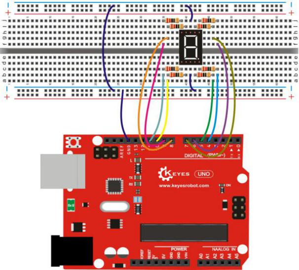

连接Keyes 2560 R3

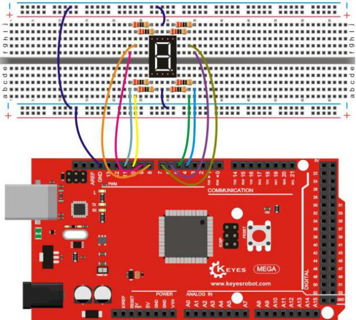

测试代码
```
//设置控制各段的数字IO 脚

int a=7;//定义数字接口7 连接a 段数码管

int b=6;// 定义数字接口6 连接b 段数码管

int c=5;// 定义数字接口5 连接c 段数码管

int d=10;// 定义数字接口11 连接d 段数码管

int e=11;// 定义数字接口10 连接e 段数码管

int f=8;// 定义数字接口8 连接f 段数码管

int g=9;// 定义数字接口9 连接g 段数码管

int dp=4;// 定义数字接口4 连接dp 段数码管

void digital_1(void) //显示数字1

{

unsigned char j;

digitalWrite(c,HIGH);//给数字接口5 引脚高电平，点亮c 段

digitalWrite(b,HIGH);//点亮b 段

for(j=7;j\<=11;j++)//熄灭其余段

digitalWrite(j,LOW);

digitalWrite(dp,LOW);//熄灭小数点DP 段

}

void digital_2(void) //显示数字2

{

unsigned char j;

digitalWrite(b,HIGH);

digitalWrite(a,HIGH);

for(j=9;j\<=11;j++)

digitalWrite(j,HIGH);

digitalWrite(dp,LOW);

digitalWrite(c,LOW);

digitalWrite(f,LOW);

}

void digital_3(void) //显示数字3

{

unsigned char j;

digitalWrite(g,HIGH);

digitalWrite(d,HIGH);

for(j=5;j\<=7;j++)

digitalWrite(j,HIGH);

digitalWrite(dp,LOW);

digitalWrite(f,LOW);

digitalWrite(e,LOW);

}

void digital_4(void) //显示数字4

{

digitalWrite(c,HIGH);

digitalWrite(b,HIGH);

digitalWrite(f,HIGH);

digitalWrite(g,HIGH);

digitalWrite(dp,LOW);

digitalWrite(a,LOW);

digitalWrite(e,LOW);

digitalWrite(d,LOW);

}

void digital_5(void) //显示数字5

{

unsigned char j;

for(j=7;j\<=9;j++)

digitalWrite(j,HIGH);

digitalWrite(c,HIGH);

digitalWrite(d,HIGH);

digitalWrite(dp,LOW);

digitalWrite(b,LOW);

digitalWrite(e,LOW);

}

void digital_6(void) //显示数字6

{

unsigned char j;

for(j=7;j\<=11;j++)

digitalWrite(j,HIGH);

digitalWrite(c,HIGH);

digitalWrite(dp,LOW);

digitalWrite(b,LOW);

}

void digital_7(void) //显示数字7

{

unsigned char j;

for(j=5;j\<=7;j++)

digitalWrite(j,HIGH);

digitalWrite(dp,LOW);

for(j=8;j\<=11;j++)

digitalWrite(j,LOW);

}

void digital_8(void) //显示数字8

{

unsigned char j;

for(j=5;j\<=11;j++)

digitalWrite(j,HIGH);

digitalWrite(dp,LOW);

}

void setup()

{

int i;//定义变量

for(i=4;i\<=11;i++)

pinMode(i,OUTPUT);//设置4～11 引脚为输出模式

}

void loop()

{

while(1)

{

digital_1();//显示数字1

delay(2000);//延时2s

digital_2();//显示数字2

delay(1000); //延时1s

digital_3();//显示数字3

delay(1000); //延时1s

digital_4();//显示数字4

delay(1000); //延时1s

digital_5();//显示数字5

delay(1000); //延时1s

digital_6();//显示数字6

delay(1000); //延时1s

digital_7();//显示数字7

delay(1000); //延时1s

digital_8();//显示数字8

delay(1000); //延时1s

}

}
```
测试结果

下载完程序后，数码管循环显示1～8 数字。

## 实验十五 74HC595驱动一位数码管实验

实验说明

上一个实验中我们直接把用开发板控制一位数码管，需要占用了较多的数字口，本实验中我们添加了一个74HC595芯片控制一位数码管，只需要用3个数字口就可以控制8个LED灯，具体设置方法可以参照以下表格。

||Q7|Q6|Q5|Q4|Q3|Q2|Q1|Q0||
||a|b|c|d|e|f|g|dp||
|0|1|1|1|1|1|1|0|0|252|
|1|0|1|1|0|0|0|0|0|96|
|2|1|1|0|1|1|0|1|0|218|
|3|1|1|1|1|0|0|1|0|242|
|4|0|1|1|0|0|1|1|0|102|
|5|1|0|1|1|0|1|1|0|182|
|6|1|0|1|1|1|1|1|0|190|
|7|1|1|1|0|0|0|0|0|224|
|8|1|1|1|1|1|1|1|0|254|
|9|1|1|1|1|0|1|1|0|246|

</tbody>
</table>

实验器材

开发板\*1

USB线\*1

74HC595\*1

一位数码管\*1

220Ω 电阻\*8

面包板\*1

面包板连接线若干

接线图

连接Keyes UNO R3

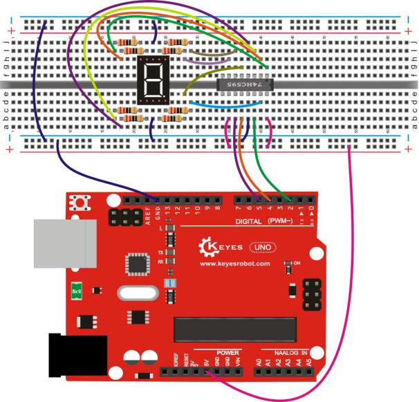

连接Keyes 2560 R3

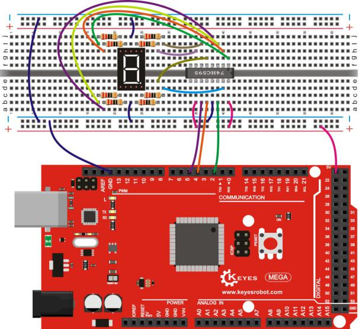

测试代码
```
int latchPin = 4;

int clockPin = 5;

int dataPin = 2; //这里定义了那三个脚

void setup ()

{

pinMode(latchPin,OUTPUT);

pinMode(clockPin,OUTPUT);

pinMode(dataPin,OUTPUT); //让三个脚都是输出状态

}

void loop()

{

int a\[10\]={

246,254,224,190,182,102,242,218,96,252};
//定义功能数组，数组依次为数码管得定义

for(int x=9; x\>-1 ;x-- ) //倒数功能循环

{

digitalWrite(latchPin,LOW);

shiftOut(dataPin,clockPin,MSBFIRST,a\[x\]); //显示数组a\[x\]

digitalWrite(latchPin,HIGH);

delay(1000);

}

}
```
测试结果

下载完程序后，数码管循环显示0～9 数字。

## 实验十六 8\*8点阵显示实验

实验说明

点阵在我们生活中很常见，很多都有用到他，比如LED广告显示屏，电梯显示楼层，公交车报站等等。

8\*8点阵共由64个发光二极管组成，且每个发光二极管是放置在行线和列线的交叉点上，当对应的某一行置高电平，某一列置低电平，则相应的二极管就亮；如要将第一个点点亮，则7脚接高电平A脚接低电平，则第一个点就亮了；如果要将第一行点亮，则第7脚要接高电平，而A、B、C、D、E、F、G、H这些引脚接低电平，那么第一行就会点亮；如要将第一列点亮，则第A脚接低电平，而0、1、2、3、4、5、6、7接高电平，那么第一列就会点亮。

在本课程中，我们只是让点阵输出一个“0”。

8\*8点阵原理图

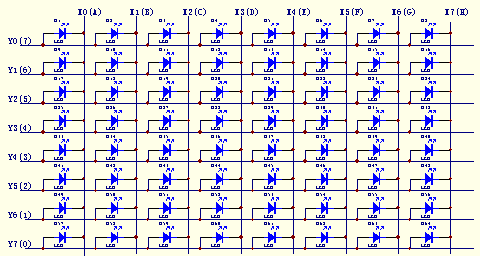

8\*8点阵实物图

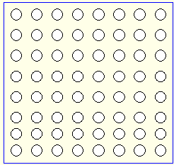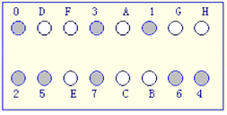

实验器材

开发板\*1

USB线\*1

8\*8点阵\*1

220Ω 电阻\*8

面包板\*1

面包板连接线若干

接线图

连接Keyes UNO R3

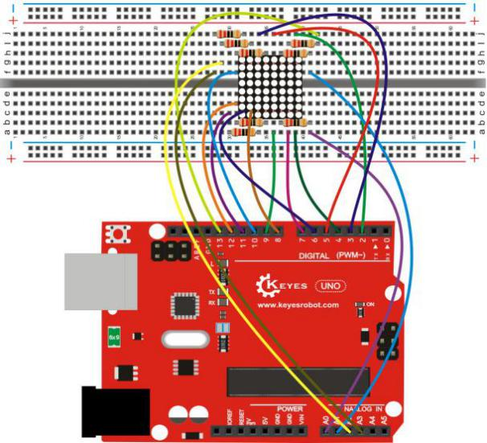

连接Keyes 2560 R3

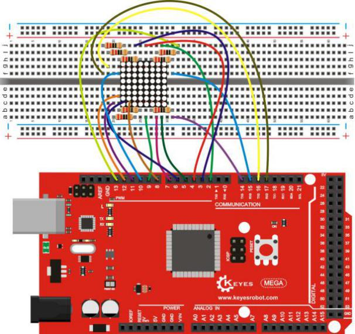

测试代码
```
//定义了一个数组，用来存放“0”字的字模

unsigned char Text\[\]={0x00,0x1c,0x22,0x22,0x22,0x22,0x22,0x1c};

void Draw_point(unsigned char x,unsigned char y)//画点函数

{

clear\_();

digitalWrite(x+2, HIGH);

digitalWrite(y+10, LOW);

delay(1);

}

void show_num(void)//显示函数，最终还是调用了画点函数。

{

unsigned char i,j,data;

for(i=0;i\<8;i++)

{

data=Text\[i\];

for(j=0;j\<8;j++)

{

if(data & 0x01)Draw_point(j,i);

data\>\>=1;

}

}

}

void setup(){

int i = 0 ;

for(i=2;i\<18;i++)

{

pinMode(i, OUTPUT);

}

clear\_();

}

void loop()

{

show_num();

}

void clear\_(void)//清除屏幕

{

for(int i=2;i\<10;i++)

digitalWrite(i, LOW);

for(int i=0;i\<8;i++)

digitalWrite(i+10, HIGH);

}
```
测试结果

下载完程序后，点阵上显示数字“0”。

## 实验十七 四位数码管显示数字实验

实验说明

在实验十五中我们使用开发板驱动一个一位数码管，本实验我们使用开发板驱动一个共阴四位数码管。驱动数码管限流电阻肯定是必不可少的，限流电阻有两种接法，一种是在d1-d4阴极接，总共接4颗。这种接法好处是需求电阻比较少，但是会产生每一位上显示不同数字亮度会不一样，1最亮，8最暗。另外一种接法就是在其他8个引脚上接，这种接法亮度显示均匀，但是用电阻较多。本次实验使用8颗220Ω电阻。

四位数码管总共有12个引脚，小数点朝下正放在面前时，左下角为1,其他管脚顺序为逆时针旋转。左上角为最大的12号管脚。

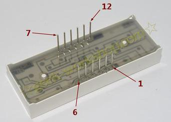

四位数码管原理图如下

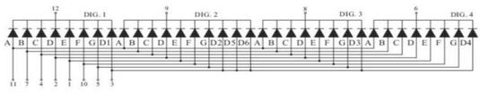

实验器材

开发板\*1

USB线\*1

四位数码管\*1

220Ω 电阻\*8

面包板\*1

面包板连接线若干

接线图

连接Keyes UNO R3

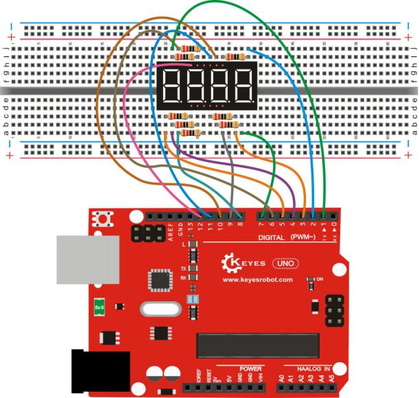

连接Keyes 2560 R3

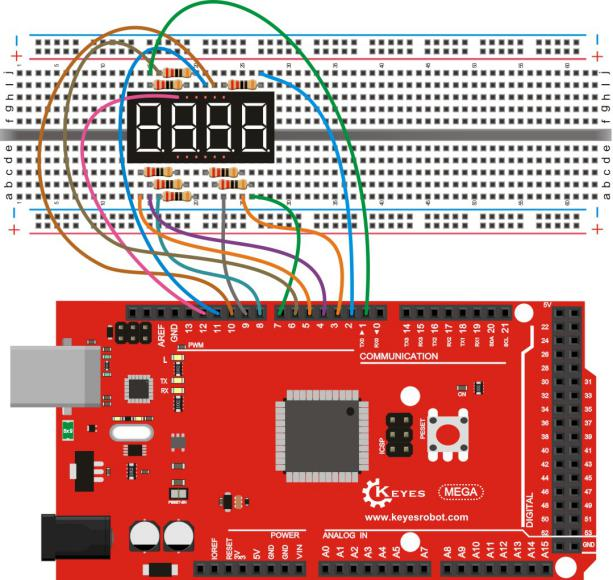

测试代码
```
int a = 1;

int b = 2;

int c = 3;

int d = 4;

int e = 5;

int f = 6;

int g = 7;

int dp = 8;

int d4 = 9;

int d3 = 10;

int d2 = 11;

int d1 = 12;

// set variable

long n = 1230;

int x = 100;

int del = 55; // fine adjustment for clock

void setup()

{

pinMode(d1, OUTPUT);

pinMode(d2, OUTPUT);

pinMode(d3, OUTPUT);

pinMode(d4, OUTPUT);

pinMode(a, OUTPUT);

pinMode(b, OUTPUT);

pinMode(c, OUTPUT);

pinMode(d, OUTPUT);

pinMode(e, OUTPUT);

pinMode(f, OUTPUT);

pinMode(g, OUTPUT);

pinMode(dp, OUTPUT);

}

/////////////////////////////////////////////////////////////

void loop()

{

int a=0;

int b=0;

int c=0;

int d=0;

unsigned long currentMillis = millis();

while(d\>=0)

{

while(millis()-currentMillis\<1000)

{

Display(1,a);

Display(2,b);

Display(3,c);

Display(4,d);

}

currentMillis = millis();

d++;

if (d\>9)

{

c++;

d=0;

}

if (c\>9)

{

b++;

c=0;

}

if (b\>9)

{

a++;

b=0;

}

if (a\>9)

{

a=0;

b=0;

c=0;

d=0;

}

}

}

///////////////////////////////////////////////////////////////

void WeiXuan(unsigned char n)//

{

switch (n)

{

case 1:

digitalWrite(d1, LOW);

digitalWrite(d2, HIGH);

digitalWrite(d3, HIGH);

digitalWrite(d4, HIGH);

break;

case 2:

digitalWrite(d1, HIGH);

digitalWrite(d2, LOW);

digitalWrite(d3, HIGH);

digitalWrite(d4, HIGH);

break;

case 3:

digitalWrite(d1, HIGH);

digitalWrite(d2, HIGH);

digitalWrite(d3, LOW);

digitalWrite(d4, HIGH);

break;

case 4:

digitalWrite(d1, HIGH);

digitalWrite(d2, HIGH);

digitalWrite(d3, HIGH);

digitalWrite(d4, LOW);

break;

default :

digitalWrite(d1, HIGH);

digitalWrite(d2, HIGH);

digitalWrite(d3, HIGH);

digitalWrite(d4, HIGH);

break;

}

}

void Num_0()

{

digitalWrite(a, HIGH);

digitalWrite(b, HIGH);

digitalWrite(c, HIGH);

digitalWrite(d, HIGH);

digitalWrite(e, HIGH);

digitalWrite(f, HIGH);

digitalWrite(g, LOW);

digitalWrite(dp, LOW);

}

void Num_1()

{

digitalWrite(a, LOW);

digitalWrite(b, HIGH);

digitalWrite(c, HIGH);

digitalWrite(d, LOW);

digitalWrite(e, LOW);

digitalWrite(f, LOW);

digitalWrite(g, LOW);

digitalWrite(dp, LOW);

}

void Num_2()

{

digitalWrite(a, HIGH);

digitalWrite(b, HIGH);

digitalWrite(c, LOW);

digitalWrite(d, HIGH);

digitalWrite(e, HIGH);

digitalWrite(f, LOW);

digitalWrite(g, HIGH);

digitalWrite(dp, LOW);

}

void Num_3()

{

digitalWrite(a, HIGH);

digitalWrite(b, HIGH);

digitalWrite(c, HIGH);

digitalWrite(d, HIGH);

digitalWrite(e, LOW);

digitalWrite(f, LOW);

digitalWrite(g, HIGH);

digitalWrite(dp, LOW);

}

void Num_4()

{

digitalWrite(a, LOW);

digitalWrite(b, HIGH);

digitalWrite(c, HIGH);

digitalWrite(d, LOW);

digitalWrite(e, LOW);

digitalWrite(f, HIGH);

digitalWrite(g, HIGH);

digitalWrite(dp, LOW);

}

void Num_5()

{

digitalWrite(a, HIGH);

digitalWrite(b, LOW);

digitalWrite(c, HIGH);

digitalWrite(d, HIGH);

digitalWrite(e, LOW);

digitalWrite(f, HIGH);

digitalWrite(g, HIGH);

digitalWrite(dp, LOW);

}

void Num_6()

{

digitalWrite(a, HIGH);

digitalWrite(b, LOW);

digitalWrite(c, HIGH);

digitalWrite(d, HIGH);

digitalWrite(e, HIGH);

digitalWrite(f, HIGH);

digitalWrite(g, HIGH);

digitalWrite(dp, LOW);

}

void Num_7()

{

digitalWrite(a, HIGH);

digitalWrite(b, HIGH);

digitalWrite(c, HIGH);

digitalWrite(d, LOW);

digitalWrite(e, LOW);

digitalWrite(f, LOW);

digitalWrite(g, LOW);

digitalWrite(dp, LOW);

}

void Num_8()

{

digitalWrite(a, HIGH);

digitalWrite(b, HIGH);

digitalWrite(c, HIGH);

digitalWrite(d, HIGH);

digitalWrite(e, HIGH);

digitalWrite(f, HIGH);

digitalWrite(g, HIGH);

digitalWrite(dp, LOW);

}

void Num_9()

{

digitalWrite(a, HIGH);

digitalWrite(b, HIGH);

digitalWrite(c, HIGH);

digitalWrite(d, HIGH);

digitalWrite(e, LOW);

digitalWrite(f, HIGH);

digitalWrite(g, HIGH);

digitalWrite(dp, LOW);

}

void Clear() // clear the screen

{

digitalWrite(a, LOW);

digitalWrite(b, LOW);

digitalWrite(c, LOW);

digitalWrite(d, LOW);

digitalWrite(e, LOW);

digitalWrite(f, LOW);

digitalWrite(g, LOW);

digitalWrite(dp, LOW);

}

void pickNumber(unsigned char n)// select number

{

switch (n)

{

case 0: Num_0();

break;

case 1: Num_1();

break;

case 2: Num_2();

break;

case 3: Num_3();

break;

case 4: Num_4();

break;

case 5: Num_5();

break;

case 6: Num_6();

break;

case 7: Num_7();

break;

case 8: Num_8();

break;

case 9: Num_9();

break;

default: Clear();

break;

}

}

void Display(unsigned char x, unsigned char Number)// take x as coordinate and display number

{

WeiXuan(x);

pickNumber(Number);

delay(1);

Clear() ; // clear the screen

}
```
测试结果

下载完程序后，数码管首先显示“0000”数值，显示跳动，每跳动一下数码管显示数值加1。当显示数值为超过“9999”后，显示数值再次变为“0000”，循环显示。

## 实验十八 1602液晶显示实验

实验说明

本次试验使用keyes UNO R3
直接驱动1602液晶显示文字。1602液晶在应用中非常广泛，它的显示容量为16×2个字符，芯片工作电压为4.5～5.5V。1602液晶在接keyes UNO R3
控制板显示文字时有两种接线法，分别为4位接法和8位接法，本实验中都会有相关说明介绍。

实验器材

开发板\*1

USB线\*1

1602 LCD\*1

可调电位器\*1

面包板\*1

面包板连接线若干

接线图

连接Keyes UNO R3

四位接法

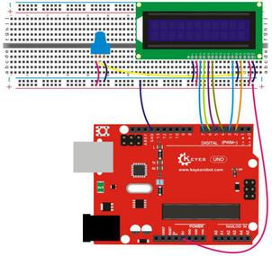

八位接法

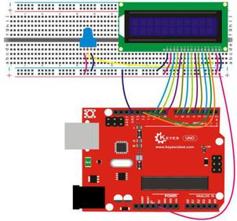

连接Keyes 2560 R3

四位接法

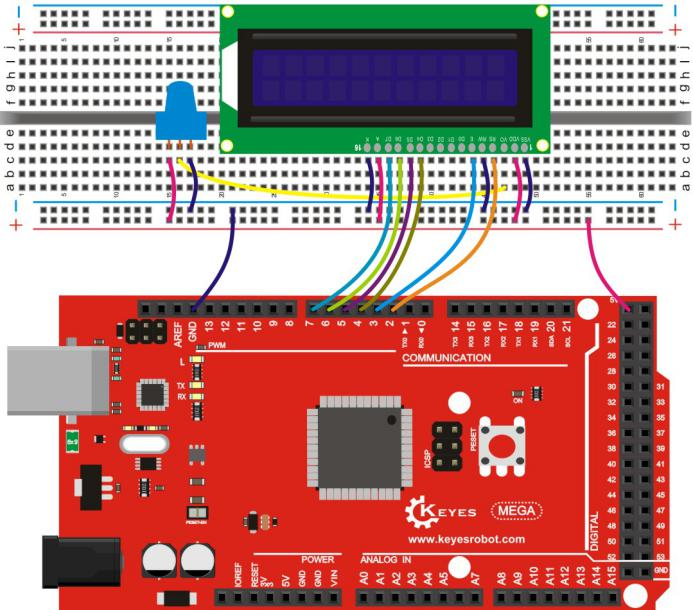

八位接法

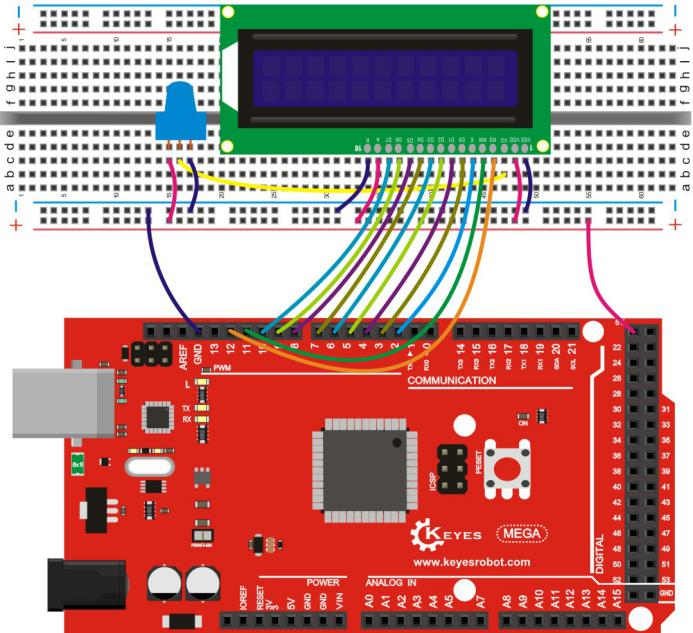

测试代码

四位接法
```
/\*

LiquidCrystal Library - Hello World

Demonstrates the use a 16x2 LCD display. The LiquidCrystal

library works with all LCD displays that are compatible with the

Hitachi HD44780 driver. There are many of them out there, and you

can usually tell them by the 16-pin interface.

This sketch prints "Hello World!" to the LCD

and shows the time.

The circuit:

\* LCD RS pin to digital pin 2

\* LCD Enable pin to digital pin3

\* LCD D4 pin to digital pin 4

\* LCD D5 pin to digital pin 5

\* LCD D6 pin to digital pin 6

\* LCD D7 pin to digital pin 7

\* LCD R/W pin to ground

\* LCD VSS pin to ground

\* LCD VCC pin to 5V

\* 10K resistor:

\* ends to +5V and ground

\* wiper to LCD VO pin

\*/

// include the library code:

\#include \<LiquidCrystal.h\>

// initialize the library with the numbers of the interface pins

LiquidCrystal lcd(2, 3, 4, 5, 6, 7);

void setup() {

// set up the LCD's number of columns and rows:

lcd.begin(16, 2);

// Print a message to the LCD.

lcd.setCursor(2,0);

lcd.print("Hello, world!");

lcd.setCursor(2,1);

lcd.print("Hello, keyes!");

}

void loop() {

}
```
八位接法
```
int DI = 12;

int RW = 11;

int DB\[\] = {3, 4,5, 6,7 ,8, 9, 10};//使用数组来定义总线需要的管脚

int Enable = 2;

void LcdCommandWrite(int value) {

// 定义所有引脚

int i = 0;

for (i=DB\[0\]; i \<= DI; i++) //总线赋值

{

digitalWrite(i,value &
01);//因为1602液晶信号识别是D7-D0(不是D0-D7)，这里是用来反转信号。

value \>\>= 1;

}

digitalWrite(Enable,LOW);

delayMicroseconds(1);

digitalWrite(Enable,HIGH);

delayMicroseconds(1); // 延时1ms

digitalWrite(Enable,LOW);

delayMicroseconds(1); // 延时1ms

}

void LcdDataWrite(int value) {

// 定义所有引脚

int i = 0;

digitalWrite(DI, HIGH);

digitalWrite(RW, LOW);

for (i=DB\[0\]; i \<= DB\[7\]; i++) {

digitalWrite(i,value & 01);

value \>\>= 1;

}

digitalWrite(Enable,LOW);

delayMicroseconds(1);

digitalWrite(Enable,HIGH);

delayMicroseconds(1);

digitalWrite(Enable,LOW);

delayMicroseconds(1); // 延时1ms

}

void setup (void) {

int i = 0;

for (i=Enable; i \<= DI; i++) {

pinMode(i,OUTPUT);

}

delay(100);

// 短暂的停顿后初始化LCD

// 用于LCD控制需要

LcdCommandWrite(0x38); // 设置为8-bit接口，2行显示，5x7文字大小

delay(64);

LcdCommandWrite(0x38); // 设置为8-bit接口，2行显示，5x7文字大小

delay(50);

LcdCommandWrite(0x38); // 设置为8-bit接口，2行显示，5x7文字大小

delay(20);

LcdCommandWrite(0x06); // 输入方式设定

// 自动增量，没有显示移位

delay(20);

LcdCommandWrite(0x0E); // 显示设置

// 开启显示屏，光标显示，无闪烁

delay(20);

LcdCommandWrite(0x01); // 屏幕清空，光标位置归零

delay(100);

LcdCommandWrite(0x80); // 显示设置

// 开启显示屏，光标显示，无闪烁

delay(20);

}

void loop (void) {

LcdCommandWrite(0x01); // 屏幕清空，光标位置归零

delay(10);

LcdCommandWrite(0x80+2);

delay(10);

// 写入欢迎信息

LcdDataWrite('H');

LcdDataWrite('e');

LcdDataWrite('l');

LcdDataWrite('l');

LcdDataWrite('o');

LcdDataWrite(',');

LcdDataWrite(' ');

LcdDataWrite('w');

LcdDataWrite('o');

LcdDataWrite('r');

LcdDataWrite('l');

LcdDataWrite('d');

LcdDataWrite('!');

delay(10);

LcdCommandWrite(0xc0+2); // 定义光标位置为第二行第二个位置

delay(10);

LcdDataWrite('H');

LcdDataWrite('e');

LcdDataWrite('l');

LcdDataWrite('l');

LcdDataWrite('o');

LcdDataWrite(',');

LcdDataWrite(' ');

LcdDataWrite('k');

LcdDataWrite('e');

LcdDataWrite('y');

LcdDataWrite('e');

LcdDataWrite('s');

LcdDataWrite('!');

LcdDataWrite(' ');

delay(5000);

}
```
测试结果

无论是四位接法还是八位接法，接好线，烧录程序上电后，通过旋转电位器调节背光，即可在1602 LCD上看到设置的显示字符。四位接法和八位接法显示一样，第一行显示
"Hello, world!"字符，第二行显示"Hello, keyes!"字符。

## 实验十九 RGB模块显示实验

实验说明

本实验中我们主要学习下RGB模块的使用方法。我们可以通过控制 R、 G、
B三个引脚的PWM电压输入可以调节三种基色（红/蓝/绿）的强度从而实现全彩的混色效果。实验中我们通过通过
R、 G、 B三个引脚的PWM电压合成了几种常用颜色灯光。

实验器材

开发板 \*1

USB线\*1

RGB模块\*1

面包板\*1

面包板连接线若干

接线图

连接Keyes UNO R3

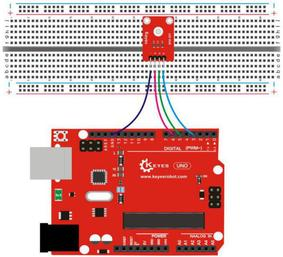

连接Keyes 2560 R3

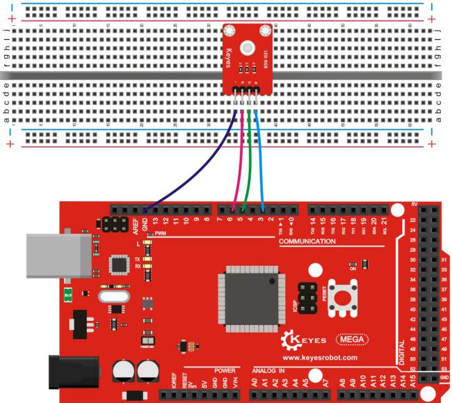

测试代码
```
int redPin = 6; // R 红色LED 控制引脚 连接到Arduino的 6脚

int greenPin = 5; // G绿色LED 控制引脚 连接到Arduino的5脚

int bluePin = 3; // B蓝色LED 控制引脚 连接到Arduino的3脚

void setup()

{

pinMode(redPin, OUTPUT); //设置redPin对应的管脚6为输出

pinMode(greenPin, OUTPUT); //设置greenPin,对应的管脚5为输出

pinMode(bluePin, OUTPUT); //设置bluePin对应的管脚3为输出

}

void loop() // run over and over again

{

// Basic colors:

color(255, 0, 0); // 红色亮

delay(1000); // 延时一秒

color(0,255, 0); //绿色亮

delay(1000); //延时一秒

color(0, 0, 255); // 蓝色灯亮

delay(1000); //延时一秒

// Example blended colors:

color(255,255,0); // 黄色亮

delay(1000); //延时一秒

color(128,0,255); // 紫色亮

delay(1000); //延时一秒

color(255,255,255); // 白色亮

delay(1000); //延时一秒

color(0,0,0); // 关闭led

delay(1000); //延时一秒

}

void color (unsigned char red, unsigned char green, unsigned char blue) //颜色控制函数

{

analogWrite(redPin, red);

analogWrite(greenPin,green);

analogWrite(bluePin, blue);

}
```
测试结果

按照上图接好线，烧录好代码，上电后，RGB模块会陆续显示红色1秒，绿色1秒，蓝色1秒，黄色1秒，紫色1秒，白色1秒，停止显示1秒，然后循环交替。

## 实验二十 超声波测距显示实验

实验说明

本实验中我们主要用到了超声波传感器和1602 LCD。实验中我们通过超声波测到超声波与前方障碍物的距离，然后在1602 LCD上显示测试结果。

实验器材

开发板 \*1

USB线\*1

1602 LCD\*1

可调电位器\*1

超声波传感器\*1

面包板\*1

面包板连接线若干

接线图

连接Keyes UNO R3

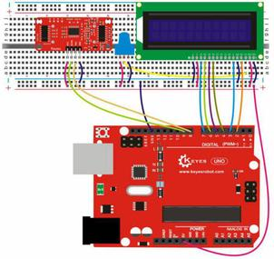

连接Keyes 2560 R3

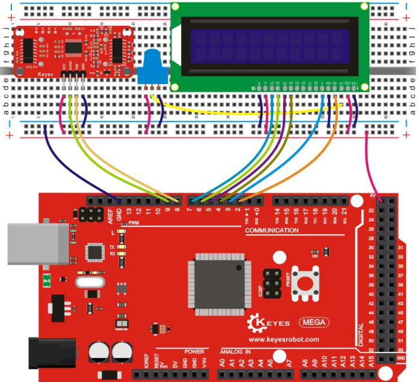

测试代码
```
\#include \<LiquidCrystal.h\>

\#define echoPin 9 // Echo Pin

\#define trigPin 8 // Trigger Pin

\#define LEDPin 13 // Onboard LED

LiquidCrystal lcd(2, 3, 4, 5, 6, 7);

int maximumRange = 200; // Maximum range needed

int minimumRange = 0; // Minimum range needed

long duration, distance; // Duration used to calculate distance

void setup() {

pinMode(trigPin, OUTPUT);

pinMode(echoPin, INPUT);

pinMode(LEDPin, OUTPUT); // Use LED indicator (if required)

lcd.begin(16, 2);

lcd.setCursor(0,0);

lcd.print("The distance is:");

}

void loop() {

/\* The following trigPin/echoPin cycle is used to determine the

distance of the nearest object by bouncing soundwaves off of it. \*/

digitalWrite(trigPin, LOW);

delayMicroseconds(2);

digitalWrite(trigPin, HIGH);

delayMicroseconds(10);

digitalWrite(trigPin, LOW);

duration = pulseIn(echoPin, HIGH);

//Calculate the distance (in cm) based on the speed of sound.

distance = duration/58.2;

if (distance \>= maximumRange || distance \<= minimumRange){

/\* Send a negative number to computer and Turn LED ON

to indicate "out of range" \*/

lcd.setCursor(0,1);

lcd.print("-1 ");

digitalWrite(LEDPin, HIGH);

}

else {

/\* Send the distance to the computer using Serial protocol, and

turn LED OFF to indicate successful reading. \*/

Serial.println(distance);

if(distance\<10)

{

lcd.setCursor(0,1);

lcd.print(distance);

lcd.setCursor(1,1);

lcd.print(" ");

}

if((distance \>=10)&&(distance\<100))

{

lcd.setCursor(0,1);

lcd.print(distance);

lcd.setCursor(2,1);

lcd.print(" ");

}

if(distance\>100)

{

lcd.setCursor(0,1);

lcd.print(distance);

}

digitalWrite(LEDPin, LOW);

}

//Delay 50ms before next reading.

delay(50);

}
```
测试结果

按照上图接好线，烧录好代码，旋转电位器调节好背光后，1602 LCD显示"The distance is:"字符；测试超声波与前方障碍物的距离，测试到数据，则在1602 LCD上显示该数据，若没测试到数据，那么就在1602 LCD上显示”-1”字符。

## 实验二十一 1302时钟显示实验

实验说明

上一实验中我们在1602 LCD上显示超声波距离，这一实验程也是将1602 LCD做显示器。这个实验相当于我们自制一个时钟，时钟上包含年、月、日、星期、小时、分钟、秒。初始时间在代码中设置，时钟自动行走，在1602 LCD显示。

实验器材

开发板\*1

USB线\*1

1602 LCD\*1

可调电位器\*1

1302时钟传感器\*1

面包板\*1

面包板连接线若干

接线图

连接Keyes UNO R3

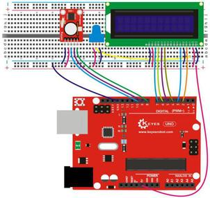

连接Keyes 2560 R3

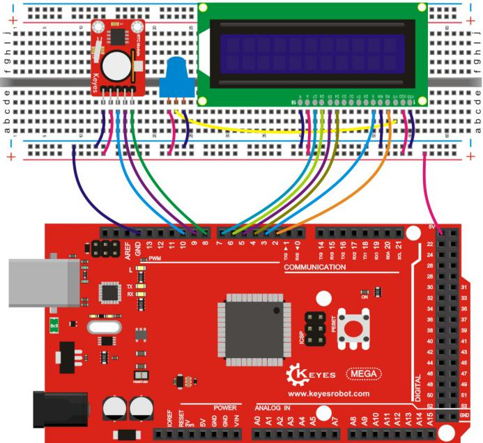

测试代码
```
\#include \<stdio.h\>

\#include \<string.h\>

\#include \<DS1302.h\>

\#include \<Wire.h\>

\#include \<LiquidCrystal.h\>

LiquidCrystal lcd(2, 3, 4, 5, 6, 7);

/\* Set the appropriate digital I/O pin connections \*/

uint8_t CE_PIN = 10; // RST

uint8_t IO_PIN = 9; // DAT

uint8_t SCLK_PIN = 8; // CLK

/\* Create buffers \*/

char buf\[50\];

char bf\[50\];

char bu\[50\];

char uf\[50\];

char day\[10\];

/\* Create a DS1302 object \*/

DS1302 rtc(CE_PIN, IO_PIN, SCLK_PIN);

void print_time()

{

/\* Get the current time and date from the chip \*/

Time t = rtc.time();

/\* Name the day of the week \*/

memset(day, 0, sizeof(day)); /\* clear day buffer \*/

switch (t.day) {

case 1:

strcpy(day, "Sunday ");

break;

case 2:

strcpy(day, "Monday ");

break;

case 3:

strcpy(day, "Tuesday ");

break;

case 4:

strcpy(day, "Wednesday");

break;

case 5:

strcpy(day, "Thursday ");

break;

case 6:

strcpy(day, "Friday ");

break;

case 7:

strcpy(day, "Saturday ");

break;

}

/\* Format the time and date and insert into the temporary buffer \*/

snprintf(buf, sizeof(buf), "%s %04d-%02d-%02d %02d:%02d:%02d",

day,

t.yr, t.mon, t.date,

t.hr, t.min, t.sec);

snprintf(bf, sizeof(bf), "%s %04d",

day, t.yr);

lcd.setCursor(0,0);

lcd.print(bf);

snprintf(bu, sizeof(bu),"%02d:%02d:%02d",

t.hr, t.min, t.sec);

/\* Print the formatted string to serial so we can see the time \*/

lcd.setCursor(0,1);

lcd.print(bu);

snprintf(uf, sizeof(uf), "%02d-%02d",

t.mon, t.date);

lcd.setCursor(11,1);

lcd.print(uf);

}

void setup()

{

lcd.begin(16, 2);

/\* Initialize a new chip by turning off write protection and clearing the

clock halt flag. These methods needn't always be called. See the DS1302

datasheet for details. \*/

rtc.write_protect(false);

rtc.halt(false);

/\* Make a new time object to set the date and time \*/

Time t(2017,7,24,10,12,22,2);

/\* Set the time and date on the chip \*/

rtc.time(t);

}

/\* Loop and print the time every second \*/

void loop()

{

print_time();

delay(1000);

}
```
测试结果

按照上图接好线，烧录好代码，旋转电位器调节好背光后，1602 LCD显示当前初始时间，然后时钟开始走动。

## 实验二十二 人体红外感应实验

实验说明

和上面两个实验一样，这个实验也是用1602 LCD做显示器。实验中，我们用到了人体红外热释电传感器，当检测到有人有附近移动时，在1602 LCD显示对应字符，当没有检测到人体在附件移动时，1602 LCD显示另一对应字符。

实验器材

开发板\*1

USB线\*1

1602 LCD\*1

可调电位器\*1

人台红外热释电传感器\*1

面包板\*1

面包板连接线若干

接线图

连接Keyes UNO R3

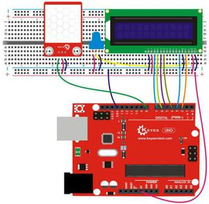

连接Keyes 2560 R3

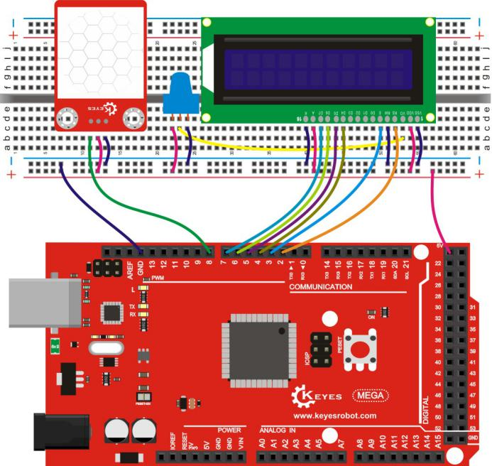

测试代码
```
\#include \<LiquidCrystal.h\>

LiquidCrystal lcd(2, 3, 4, 5, 6, 7);

byte sensorPin = 8;//定义数字口8

byte indicator = 13;//定义数字口13

void setup()

{

pinMode(sensorPin,INPUT);//设置数字口3位输入

pinMode(indicator,OUTPUT);//设置数字口13为输出

lcd.begin(16, 2);

}

void loop()

{

byte state = digitalRead(sensorPin);//读取到数字口3的数值赋值给state

digitalWrite(indicator,state);//控制数值口13的状态

if(state ==
1)//当数值口3位高电平时，串口监视器输出对应字符，并自动换行

{

lcd.setCursor(0,0);

lcd.print("Somebody is ");

lcd.setCursor(0,1);

lcd.print("in this area! ");

}

else if(state == 0)

{

lcd.setCursor(0,0);

lcd.print("No one! ");

lcd.setCursor(0,1);

lcd.print("No one! ");

}

}
```
测试结果

按照上图接好线，烧录好代码，旋转电位器调节好背光后，当检测到有人有附近移动时，在1602 LCD第一行显示显示"Somebody is "字符，第二行显示"in this area!"字符；当没有检测到人体在附件移动时，1602 LCD两行都显示"No one!"字符。


