Keyes 基础版 学习套件 for Arduino

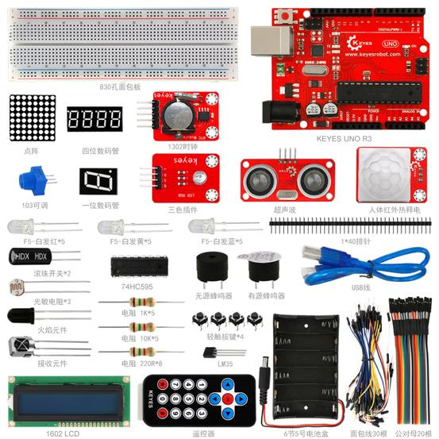

# 产品介绍

Keyes 基础版 学习套件是keyes推出的一款
基于Arduino开发板的套件，套件包含各种传感器元件、模块、面包线、UNO R3
控制板等物品，适合爱好电子的初学者使用。我们还会根据这些元件，提供一些基于Arduino开发板的一些学习课程，包含接线方法，测试代码等，让你对这些电子元件和Arduino开发板有个初步的了解。

以下是Keyes基础版学习套件的核心特点说明：

# 特点

 1. **Arduino原生开发支持**
   - 100%兼容Arduino IDE开发环境
   - 提供USB-B接口直连编程（支持Windows/MacOS/Linux）

 2. **零基础入门套装**
   - 包含37个标准元件：
     - 15种传感器（红外/温湿度/火焰等）
     - 8种执行器（舵机/继电器/蜂鸣器等）
     - 基础工具包（面包板+杜邦线+USB线）
   - 元件标注防呆接口（PH2.0 3PIN标准）

 3. **结构化课程体系**
   - 分三个阶段教学：
    - 基础实验（LED/按钮控制）
    - 传感器应用（超声波测距/光线感应）
    - 综合项目（智能台灯/安防系统）

 4. **扩展开发能力**
   - 预留I2C/SPI/UART通信接口
   - 兼容Keyes系列扩展板（电机驱动/WiFi模块等）
 
 5. **典型应用场景**：  
电子制作课堂｜创客工作坊｜STEM教育｜毕业设计原型开发

# 清单

|编码|名称|规格型号|数量|图片|
|-|-|-|-|-|
|1|遥控器|JMP-1 17键86*40*6.5MM 黑色|1||
|2|keyes传感器|keyes 人体红外热释电传感器|1|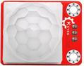|
|3|keyes传感器|keyes 1302时钟传感器|1|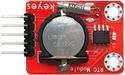|
|4|keyes传感器|keyes 超声波传感器|1|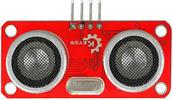|
|5|keyes模块|keyes 插件RGB模块|1|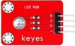|
|6|LCD|1602 COB 5V 蓝屏|1|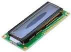|
|7|蜂鸣器|无源 12*8.5MM 5V 普通分体 2K|1||
|8|蜂鸣器|有源 12*9.5MM 5V 普通分体 2300Hz|1||
|9|轻触按键|6*6*5MM 插件|4|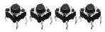|
|10|传感器元件|LM35DZ|1||
|11|传感器元件|5MM 光敏电阻|3||
|12|传感器元件|红外接收 5MM火焰|1||
|13|传感器元件|红外接收 VS1838B|1||
|14|滚珠开关|HDX-2801 两脚一样|2||
|15|LED|F5-白发红-短|5|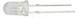|
|16|LED|F5-白发黄-短|5||
|17|LED|F5-白发蓝-短|5||
|18|电阻|碳膜色环 1/4W 1% 220R|8||
|19|电阻|碳膜色环 1/4W 1% 1K|5||
|20|电阻|碳膜色环 1/4W 1% 10K|5||
|21|USB线|AM/BM 透明蓝 OD:5.0 L=50cm|1||
|22|面包线|面包板连接线30根|1|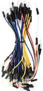|
|23|杜邦线|公对母20CM/40P/2.54/10股铜包铝 24号线BL|0.5|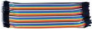|
|24|点阵|20*20MM 1.9MM 红色 共阳|1||
|25|数码管|一位0.56英寸共阴红|1||
|26|数码管|四位0.36英寸共阴红|1||
|27|可调电位器|3386 MU 103|1||
|28|IC|74HC595 DIP|1||
|29|电池盒+插杆|6节5号带线15CM露线 带DC插杆|1|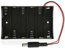|
|30|面包板|830孔 ZY-102|1|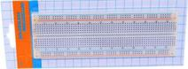|
|31|排针|1*40P 黑色 2.54 针长3.0等边|1|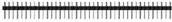|
|32|电阻卡|100*70MM|1||
|33|KE0080开发板|Keyes UNO R3 开发板 for arduino 红色 环保|1|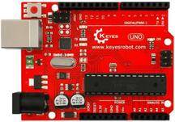|
|33|KE0081开发板|Keyes 2560 R3 开发板 for arduino 红色 环保|1||

# 相关资料链接地址

https://pan.baidu.com/s/1kVejFsb

